Preview | Size | URL
------- | ---- | ---
[aplazame-banner-alt-120x240-2x-240x480.png](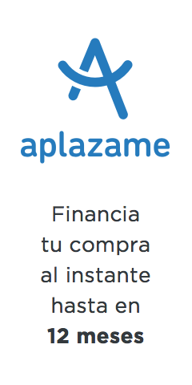) |
``` yaml
width: 240px
height: 480px
```
| [aplazame-banner-alt-120x240-2x-240x480.png](aplazame-banner-alt-120x240-2x-240x480.png)
[aplazame-banner-alt-120x240.png](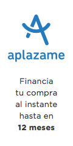) |
``` yaml
width: 120px
height: 240px
```
| [aplazame-banner-alt-120x240.png](aplazame-banner-alt-120x240.png)
[aplazame-banner-alt-120x600-2x-240x1200.png](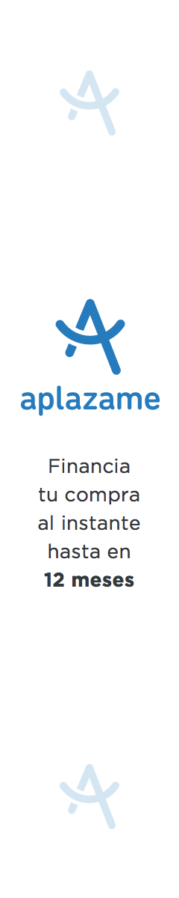) |
``` yaml
width: 240px
height: 1200px
```
| [aplazame-banner-alt-120x600-2x-240x1200.png](aplazame-banner-alt-120x600-2x-240x1200.png)
[aplazame-banner-alt-120x600.png]() |
``` yaml
width: 120px
height: 600px
```
| [aplazame-banner-alt-120x600.png](aplazame-banner-alt-120x600.png)
[aplazame-banner-alt-120x90-2x-240x180.png]() |
``` yaml
width: 240px
height: 180px
```
| [aplazame-banner-alt-120x90-2x-240x180.png](aplazame-banner-alt-120x90-2x-240x180.png)
[aplazame-banner-alt-120x90.png](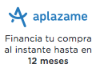) |
``` yaml
width: 120px
height: 90px
```
| [aplazame-banner-alt-120x90.png](aplazame-banner-alt-120x90.png)
[aplazame-banner-alt-150x100-2x-300x200.png]() |
``` yaml
width: 300px
height: 200px
```
| [aplazame-banner-alt-150x100-2x-300x200.png](aplazame-banner-alt-150x100-2x-300x200.png)
[aplazame-banner-alt-150x100.png](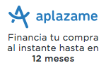) |
``` yaml
width: 150px
height: 100px
```
| [aplazame-banner-alt-150x100.png](aplazame-banner-alt-150x100.png)
[aplazame-banner-alt-170x100-2x-340x200.png](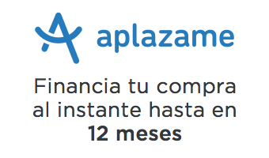) |
``` yaml
width: 340px
height: 200px
```
| [aplazame-banner-alt-170x100-2x-340x200.png](aplazame-banner-alt-170x100-2x-340x200.png)
[aplazame-banner-alt-170x100.png](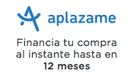) |
``` yaml
width: 170px
height: 100px
```
| [aplazame-banner-alt-170x100.png](aplazame-banner-alt-170x100.png)
[aplazame-banner-alt-190x100-2x-380x200.png]() |
``` yaml
width: 380px
height: 200px
```
| [aplazame-banner-alt-190x100-2x-380x200.png](aplazame-banner-alt-190x100-2x-380x200.png)
[aplazame-banner-alt-190x100.png](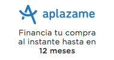) |
``` yaml
width: 190px
height: 100px
```
| [aplazame-banner-alt-190x100.png](aplazame-banner-alt-190x100.png)
[aplazame-banner-alt-234x400-2x-468x800.png](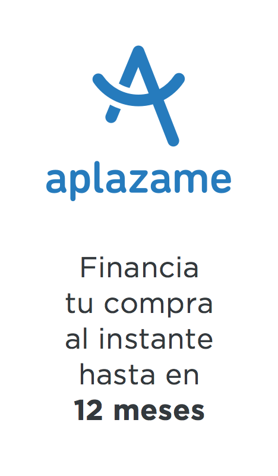) |
``` yaml
width: 468px
height: 800px
```
| [aplazame-banner-alt-234x400-2x-468x800.png](aplazame-banner-alt-234x400-2x-468x800.png)
[aplazame-banner-alt-234x400.png](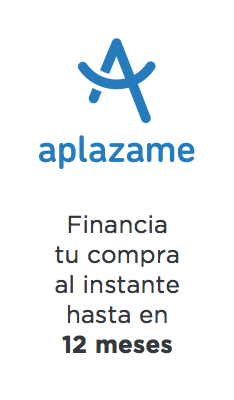) |
``` yaml
width: 234px
height: 400px
```
| [aplazame-banner-alt-234x400.png](aplazame-banner-alt-234x400.png)
[aplazame-banner-alt-234x60-2x-468x120.png](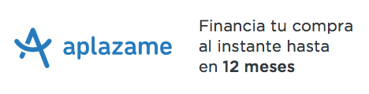) |
``` yaml
width: 468px
height: 120px
```
| [aplazame-banner-alt-234x60-2x-468x120.png](aplazame-banner-alt-234x60-2x-468x120.png)
[aplazame-banner-alt-234x60.png]() |
``` yaml
width: 234px
height: 60px
```
| [aplazame-banner-alt-234x60.png](aplazame-banner-alt-234x60.png)
[aplazame-banner-alt-250x250-2x-500x500.png](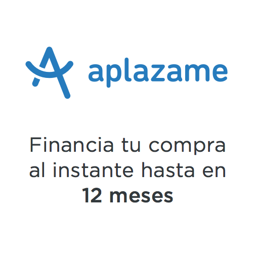) |
``` yaml
width: 500px
height: 500px
```
| [aplazame-banner-alt-250x250-2x-500x500.png](aplazame-banner-alt-250x250-2x-500x500.png)
[aplazame-banner-alt-250x250.png](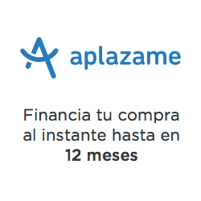) |
``` yaml
width: 250px
height: 250px
```
| [aplazame-banner-alt-250x250.png](aplazame-banner-alt-250x250.png)
[aplazame-banner-alt-280x280-2x-560x560.png]() |
``` yaml
width: 560px
height: 560px
```
| [aplazame-banner-alt-280x280-2x-560x560.png](aplazame-banner-alt-280x280-2x-560x560.png)
[aplazame-banner-alt-280x280.png](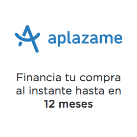) |
``` yaml
width: 280px
height: 280px
```
| [aplazame-banner-alt-280x280.png](aplazame-banner-alt-280x280.png)
[aplazame-banner-alt-300x250-2x-600x500.png]() |
``` yaml
width: 600px
height: 500px
```
| [aplazame-banner-alt-300x250-2x-600x500.png](aplazame-banner-alt-300x250-2x-600x500.png)
[aplazame-banner-alt-300x250.png](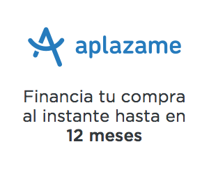) |
``` yaml
width: 300px
height: 250px
```
| [aplazame-banner-alt-300x250.png](aplazame-banner-alt-300x250.png)
[aplazame-banner-alt-300x50-2x-600x100.png]() |
``` yaml
width: 600px
height: 100px
```
| [aplazame-banner-alt-300x50-2x-600x100.png](aplazame-banner-alt-300x50-2x-600x100.png)
[aplazame-banner-alt-300x50.png]() |
``` yaml
width: 300px
height: 50px
```
| [aplazame-banner-alt-300x50.png](aplazame-banner-alt-300x50.png)
[aplazame-banner-alt-336x280-2x-672x560.png]() |
``` yaml
width: 672px
height: 560px
```
| [aplazame-banner-alt-336x280-2x-672x560.png](aplazame-banner-alt-336x280-2x-672x560.png)
[aplazame-banner-alt-336x280.png](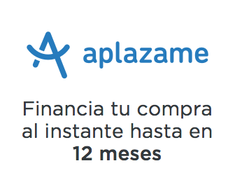) |
``` yaml
width: 336px
height: 280px
```
| [aplazame-banner-alt-336x280.png](aplazame-banner-alt-336x280.png)
[aplazame-banner-alt-468x60-2x-936x120.png]() |
``` yaml
width: 936px
height: 120px
```
| [aplazame-banner-alt-468x60-2x-936x120.png](aplazame-banner-alt-468x60-2x-936x120.png)
[aplazame-banner-alt-468x60.png]() |
``` yaml
width: 468px
height: 60px
```
| [aplazame-banner-alt-468x60.png](aplazame-banner-alt-468x60.png)
[aplazame-banner-alt-540x200-2x-1080x400.png](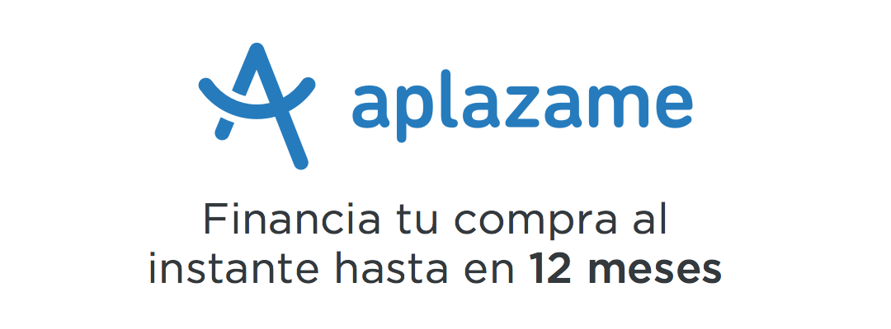) |
``` yaml
width: 1080px
height: 400px
```
| [aplazame-banner-alt-540x200-2x-1080x400.png](aplazame-banner-alt-540x200-2x-1080x400.png)
[aplazame-banner-alt-540x200.png](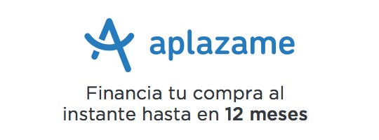) |
``` yaml
width: 540px
height: 200px
```
| [aplazame-banner-alt-540x200.png](aplazame-banner-alt-540x200.png)
[aplazame-banner-alt-728x90-2x-1456x180.png]() |
``` yaml
width: 1456px
height: 180px
```
| [aplazame-banner-alt-728x90-2x-1456x180.png](aplazame-banner-alt-728x90-2x-1456x180.png)
[aplazame-banner-alt-728x90.png]() |
``` yaml
width: 728px
height: 90px
```
| [aplazame-banner-alt-728x90.png](aplazame-banner-alt-728x90.png)
[aplazame-banner-alt-800x66-2x-1600x132.png]() |
``` yaml
width: 1600px
height: 132px
```
| [aplazame-banner-alt-800x66-2x-1600x132.png](aplazame-banner-alt-800x66-2x-1600x132.png)
[aplazame-banner-alt-800x66.png]() |
``` yaml
width: 800px
height: 66px
```
| [aplazame-banner-alt-800x66.png](aplazame-banner-alt-800x66.png)
